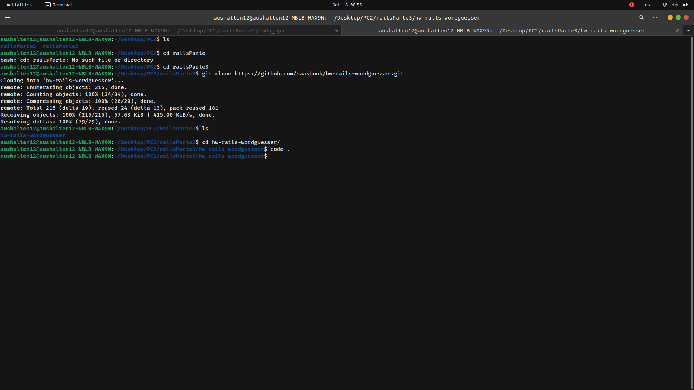
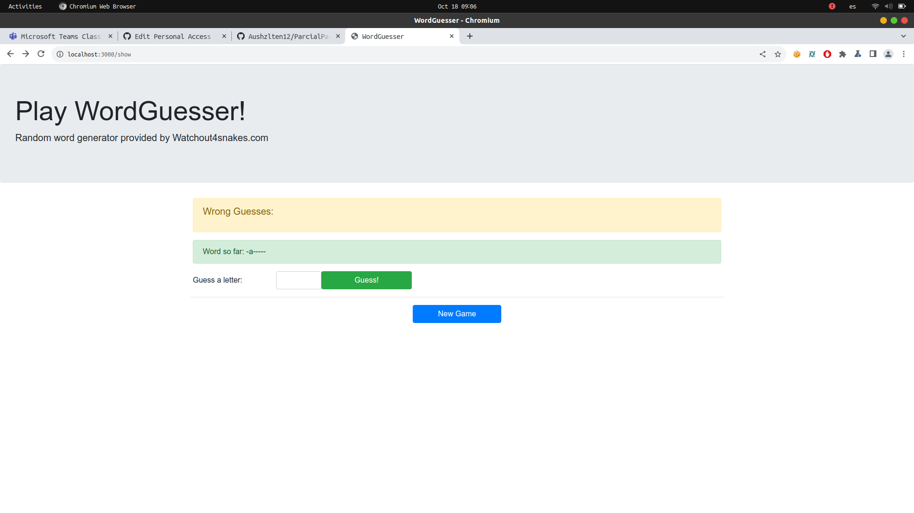

# Parte 3 del examen Parcial

Primero clonamos el repositorio

## Preguntas

1. ¿Cuál es el objetivo de ejecutar bundle install?
  Su objetivo es instalar las gemas que la aplicacion necesita. Para ello las gemas deben estar definidias en el archivo Gemfile y con bundle install se creara Gemfile.lock
2. ¿Por qué es una buena práctica especificar –without production al ejecutarlo en su computadora de desarrollo?
  Porque habrá gemas que se requieran solo para producción y puede conllevar a fallos en la instalación. Por ejemplo, en el uso de base de datos, en desarrollo se puede usar sqlite3 pero en producción postgres necesitando la gema pg, esta gema no se necesita instalar en nuestra computadora
3. (Para la mayoría de las aplicaciones Rails, también tendrías que crear y inicializar la base de datos de desarrollo, pero al igual que la aplicación Sinatra, esta aplicación no utiliza ninguna base de datos).
  Bueno en este caso no importaría mucho usar -without production, ya que viendo el Gemfile no hay gemas especificas para producción. Y si no se usará una base de datos, pues dada mi explicación anterior no tendriamos problemas.

Desplegamos localmente la aplicación en localhost:3000

Se puede ver que la funcionalidad es la misma que la de la aplicación en Sinatra.Existe la acción de ganar, perder, jugar. No se puede hacer trampa. El direccionamiento de las rutas es correcto,es igual al de la app de Sinatra.

## Preguntas
 
1. ¿En qué parte de la estructura del directorio de la aplicación Rails está el código correspondiente al modelo WordGuesserGame?
En app/models/word_guesses_game.rb esta la lógica del juego, esta parte en Sinatra estaba en el directorio lib/ 
2. ¿En qué archivo está el código que más se corresponde con la lógica del archivo app.rb de las aplicaciones Sinatra que maneja las acciones entrantes del usuario?
En el archivo app/controllers/game_controller.rb, esta los métodos de cada ruta, métodos como create, guess, etc.
3. ¿Qué clase contiene ese código?
La clase GameController, que contiene los mismo métodos que en app.rb de Sinatra, claro que en sinatra se debe espeficar si es método POST o GET, en cambio en Rails no es necesario se define como un método de una clase. 
4. ¿De qué otra clase (que es parte del framework Rails) hereda esa clase?
Hereda a la clase application_controller que cuenta con una excepción que parece ser si es en caso la API no responda a la solicitud
5. ¿En qué directorio está el código correspondiente a las vistas de la aplicación Sinatra (new.erb, show.erb, etc.)?
Esta en el directiorio app/views.
6. Los sufijos de nombre de archivo para estas vistas son diferentes en Rails que en la aplicación Sinatra. ¿Qué información proporciona el sufijo situado más a la derecha del nombre del archivo (por ejemplo: en foobar.abc.xyz, el sufijo .xyz) sobre el contenido del archivo?
El sufijo .erb proporciona la informacion de que se esta usando el lenguaje Ruby para poder instanciar variables o metodos en la vista
7. ¿Qué información te brinda el otro sufijo sobre lo que se le pide a Rails que haga con el archivo?
El otro sufijo es .html lo que pide a Rails es mostrar en el navegador ya que para eso sirve HTML, y mayormente el contenido de un archivo de la vista cuenta con codigo html.
8. ¿En qué archivo está la información de la aplicación Rails que asigna rutas (por ejemplo, GET/new) a las acciones del controlador?
Esta en el archivo config/routes.rb, en este archivo estan definidos los métodos POST o GET para cada ruta, en dos archivos hacemos en Rails lo que Sinatra hace en uno.
9. ¿Cuál es el papel de la opción :as => 'name' en las declaraciones de ruta de config/routes.rb?
Es un nombre que se le da a esa ruta para usarla al momento de hacer boton y redirigirlo a tal ruta si se tiene :as => 'name' entonces en la vista podria usarse link_to name_path

## Preguntas

1. En la versión de Sinatra, los bloques before do...end y after do...end se utilizan para la gestión de sesiones. ¿Cuál es el equivalente más cercano en esta aplicación Rails y en qué archivo encontramos el código que lo hace?
Se encuentra en el archivo app/controller/game_controller.rb y en Rails usa before_action y after_action, en estos métodos usa otros métodos definidos en ese mismo archivo y estos ultimos son similares al codigo que esta en los bloques do...end y after...end en Sinatra
2. Un formato de serialización popular para intercambiar datos entre aplicaciones web es JSON. ¿Por qué no funcionaría utilizar JSON en lugar de YAML? (Reemplaza YAML.load() con JSON.parse() y .to_yaml con .to_json para realizar esta prueba. Tendrás que borrar las cookies asociadas con localhost:3000 o reiniciar tu navegador con un nuevo Incognito/ Ventana de navegación privada, para borrar la sesión[]. Según los mensajes de error que recibe al intentar utilizar la serialización JSON, debería poder explicar por qué la serialización YAML funciona en este caso pero JSON no).
Porque YAML es más facil de leer y para cargar una variable a diferencia de JSON

## Preguntas

1. En la versión de Sinatra, cada acción del controlador termina con redirect (que, como puedes ver, se convierte en redirección_to en Rails) para redirigir al jugador a otra acción, o con erb para representar una vista. ¿Por qué no hay llamadas explícitas correspondientes a erb en la versión Rails?
Porque cuando se usa redirect_to en Rails lo hace a una dirección que esta en el archivo routes.rb, por ejemplo a game_path. Y a esa dirección al ya definirle un método y si esta creado una vista con ese nombre, esa vista se le asocia directamente a la ruta.
2. En la versión de Sinatra, codificamos directamente un formulario HTML usando la etiqueta <form>, mientras que en la versión de Rails usamos un método Rails form_tag, aunque sería perfectamente legal usar etiquetas HTML <form> sin formato en Rails. ¿Se te ocurre alguna razón por la que Rails podría introducir este "nivel de direccionamiento indirecto"?
Esto es para poder usar ciertas variables usando Ruby dentro del formulario y usan al igual que en redirect en este caso create_game_path para enviar ese form a esa ruta. 
3. ¿Cómo se manejan los elementos del formulario, como campos de texto y botones, en Rails? (Nuevamente, el HTML sin formato sería legal, pero ¿cuál es la motivación detrás de la forma en que Rails lo hace?)
Se maneja con metodos por ejemplo link_to , submit_tag, esto en el caso de botones, en los campos de texto en este caso ha usado HTML de forma normal. Claro que se le agregan parametros como clases para agregarle estilso
4. En la versión de Sinatra, las vistas de show, win y lose reutilizan el código en la vista new que ofrece un botón para iniciar un nuevo juego. ¿Qué mecanismo de Rails permite reutilizar esas vistas en la versión de Rails?.
Usa el metodo render hacia el template de la ruta game/new para mostrar el contenido de esa vista que es el boton.

## Preguntas 

1. ¿Cuál es una explicación cualitativa de por qué no fue necesario modificar los escenarios de Cucumber y las definiciones de pasos para que funcionaran igualmente bien con las versiones de la aplicación Sinatra o Rails? (1 punto)
Porque estos test de cucumber se ejecutan sobre el codigo escrito en game_controller.rb, y este codigo es el mismo que el de Sinatra. Es decir estos escenarios de cucumber se estarian ejecutando de la misma forma que en Sinatra y si la app de Sinatra funciona de manera correcta por ende esta app en Rails también.